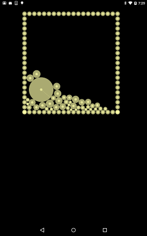

# Flutter (skyengine)

This book is memo that kyorohiro have been learning about flutter with dart.. 

### About Flutter

Flutter is dartlang framework for mobile platform.

## REF
* http://flutter.io/
* https://github.com/domokit/mojo

## LICENSES
Thid document 's licenses is following
http://creativecommons.org/licenses/by/4.0/

## CONTENT
* [hello](doc/hello/README.md)
  * [helloworld](hello/doc/README.md)
  * [build flutter](build_flutter/README.md)
  * [build as android app](build_android/README.md)
    * [draw text](test_android/doc/README.md)
    * [draw image](test_android_2/doc/README.md)
    * [set icon](test_android_3/doc/README.md)
  * [build as ios app](build_ios/README.md)
  * [build as linux app](build_linux/README.md)
  * [build as mac app](build_linux/README.md)
  * [build mojo](mojo_na_install/README.md)
* [rendering](doc/rendering/README.md)
  * [draw_rect](draw_rect/doc/README.md)
  * [anime_rect](anime_rect/doc/README.md)
  * [anime_rect(use animation.dart)](anime_rect_1/doc/README.md)
  * [draw_image](draw_image/doc/README.md)
  * [rotate_image](rotate_image/doc/README.md)
  * [draw_image_from_assets](draw_image_from_assets/doc/README.md)
  * [sound_test(rendering & service)](sound_test/doc/README.md)
  * [touch_test](touch_event/doc/README.md)
  * [multitouch_test](multitouch_event/doc/README.md)
  * [**[@]demo::mini game(spacewar!)**](spacewar/doc/README.md)
  * [draw_text](draw_text/doc/README.md)
  * [draw_path](draw_path/doc/README.md)
  * [draw_vertexs](draw_vertices/doc/README.md)
  * [draw_vertexs_with_image](draw_vertices_1/doc/README.md)
  * [**[@]demo:3d anime**](draw_vertices_demo/doc/README.md)
  * [input text from ime(RenderObject)](edit_text_1/doc/README.md)
* [widget](doc/widgets/README.md)
  * [text](widget_text/doc/README.md)
  * [network image](widget_networkimage/doc/README.md)
  * [container](widget_container/doc/README.md)
  * [row](widget_row/doc/README.md)
  * [col](widget_col/doc/README.md)
  * [flexible](widget_flexible/doc/README.md)
  * [navigator](widget_navigator/doc/README.md)
  * [stateful component](widget_stateful/doc/README.md)
  * [scaffold](widget_scaffold/doc/README.md)
  * [scaffold x drawer](widget_scaffold_drawer/doc/README.md)
  * [scrollable viewport](widget_scrollableviewport/doc/README.md)
  * [input text from ime(EditableText)](edit_text/doc/README.md)
* [dart:io](doc/dartio/README.md)
  * [HttpClient Post & Get](dartio_test/doc/README.md)
  * [NetworkInterface](dartio_networkinterface/doc/README.md)
  * [TCP Socket](dartio_tcp/doc/README.md)
  * [UDP Socket](dartio_udp/doc/README.md)
  * [File Path(dart:io & service)](dartio_service_path/doc/README.md)
  * [File Create & Permission](dartio_file/doc/README.md)
* [dart:ui](doc/dartui/README.md)
  * [draw rect](dartui_draw/doc/README.md)
  * [pointer event](dartui_event/doc/README.md)
* [mojo for flutter](doc/mojo/README.md)
  * [get and post request](mojo_urlRequest/doc/README.md)
  * [sensor test](mojo_sensor/doc/README.md)
  * [**[@]demo:gravity sensor**](mojo_sensor_demo/doc/README.md)
* [2d physics for scratch](doc/physics2d/README.md)
  * [collision without rotation](ph_2d_boun_no_rot/doc/README.md)
  * [collision without friction](ph_2d_boun_no_friction/doc/README.md)
  * [b]
* [2d physics for newton](doc/physics2d_newton/README.md)
* [mojo for native](doc/mojo_native/README.md)
  * [build mojo](mojo_na_install/README.md)

