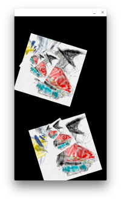

# Make Chromeapp from android app

Dart x Flutter  --( ARC Welder )--> Chrome App 


## example
#### [1] make certification

```
$ keytool -genkey -v -keystore dummy.keystore -alias umiuni2d -keyalg RSA -keysize 2048 -validity 10000

```

#### [2] clone sample code & pub

```
$ git clone https://github.com/kyorohiro/umiuni2d_check.git
$ cd umiuni2d_check/flutter_c
$ pub get
$ pub upgrade
```

#### [3] make release apk

###### [3-1] draw rect test

```
$ flutter build apk --release  --keystore=./dummy.keystore --keystore-password=umiuni2d  --keystore-key-alias=umiuni2d --target ./lib/render/animeRect_scheduller.dart 
```

###### [3-2] anime rect test

```
$ flutter build apk --release  --keystore=./dummy.keystore --keystore-password=umiuni2d  --keystore-key-alias=umiuni2d --target ./lib/render/drawImage_assets.dart
```

###### [3-3] draw image test

```
$ flutter build apk --release  --keystore=./dummy.keystore --keystore-password=umiuni2d  --keystore-key-alias=umiuni2d --target ./lib/render/drawImage_assets.dart
```
comment : failed to draw png now(2016y5m26d)

###### [3-4] touch test

```
$ flutter build apk --release  --keystore=./dummy.keystore --keystore-password=umiuni2d  --keystore-key-alias=umiuni2d --target ./lib/render/touchTest.dart 
```

#### [4] install arc welder & bake chrome app

http://www.howtogeek.com/214734/how-to-use-googles-arc-welder-to-run-android-apps-in-chrome/


#### [5] Check on MAC

