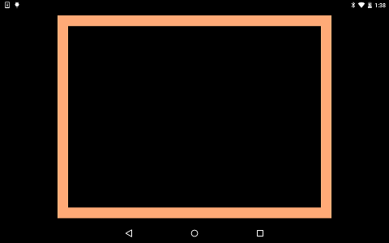

# Dart:UI Draw

https://github.com/kyorohiro/hello_skyengine/tree/master/dartui_draw



```
// flutter: ">=0.0.15"
// following code is checked in 2015/12/13
import 'dart:ui' as ui;
import 'dart:typed_data';
import 'package:vector_math/vector_math_64.dart';

// ex 3:4 game screen
double stageWidth = 800.0;
double stageHeight = 600.0;
ui.Rect stageSize = new ui.Rect.fromLTWH(0.0, 0.0, stageWidth, stageHeight);

ui.Scene createScene(ui.Picture picture) {
  double widthPaddingless  = ui.window.size.width-ui.window.padding.left-ui.window.padding.right;
  double heightPaddingless = ui.window.size.height-ui.window.padding.top-ui.window.padding.bottom;
  double rw = widthPaddingless/stageWidth;
  double rh = heightPaddingless/stageHeight;
  double stageRatio = (rw<rh?rw:rh);
  double t = ui.window.padding.top;
  double l = ui.window.padding.left + (widthPaddingless-stageWidth*stageRatio)/2.0;

  ui.Rect sceneBounds = new ui.Rect.fromLTWH(
    0.0, 0.0,
    ui.window.size.width * ui.window.devicePixelRatio,
    ui.window.size.height * ui.window.devicePixelRatio
  );

  Matrix4 mat = new Matrix4.identity();
  mat.translate(l*ui.window.devicePixelRatio, t*ui.window.devicePixelRatio);
  mat.scale(stageRatio*ui.window.devicePixelRatio, stageRatio*ui.window.devicePixelRatio, 1.0);

  ui.SceneBuilder sceneBuilder = new ui.SceneBuilder(sceneBounds);
  sceneBuilder.pushTransform(mat.storage);
  sceneBuilder.pushClipRect(stageSize);
  sceneBuilder.addPicture(ui.Offset.zero, picture, stageSize);
  sceneBuilder.pop();
  sceneBuilder.pop();
  return sceneBuilder.build();
}

void onPaint(Duration timeStamp) {
  print("---onPaint ${timeStamp}");
  //
  ui.PictureRecorder recorder = new ui.PictureRecorder();
  ui.Canvas canvas = new ui.Canvas(recorder, stageSize);

  //
  ui.Paint paint = new ui.Paint();
  paint.strokeWidth = 30.0;
  paint.style = ui.PaintingStyle.stroke;
  paint.color = new ui.Color.fromARGB(0xff, 0xff, 0xaa, 0x77);
  ui.Rect drawRectSize = new ui.Rect.fromLTWH(
    paint.strokeWidth, paint.strokeWidth,
    stageWidth-paint.strokeWidth*2,
    stageHeight-paint.strokeWidth*2);
  canvas.drawRect(drawRectSize, paint);
  ui.Picture picture = recorder.endRecording();

  ui.window.render(createScene(picture));
}

void main() {
  ui.window.onBeginFrame =  onPaint;
  ui.window.onMetricsChanged = (){
      ui.window.scheduleFrame();
  };
  ui.window.scheduleFrame();
}
```
