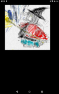

# Draw Image from assets

https://github.com/kyorohiro/hello_skyengine/tree/master/draw_image_from_assets



```
// following code is checked in 2015/11/14
//
// need flutter.yaml from 2015/12/13
//
import 'package:flutter/widgets.dart';
import 'package:flutter/rendering.dart';
import 'dart:async';
import 'package:flutter/services.dart';
import 'dart:ui' as sky;

main() async {
  runApp(new DrawImageWidget());
}

AssetBundle getAssetBundle() {
  if (rootBundle != null) {
    return rootBundle;
  } else {
    return new NetworkAssetBundle(new Uri.directory(Uri.base.origin));
  }
}

class ImageLoader {
  static Future<sky.Image> load(String url) async {
    AssetBundle bundle = getAssetBundle();
    ImageResource resource = bundle.loadImage(url);
    return resource.first;
  }
}

class DrawImageWidget extends OneChildRenderObjectWidget {
  double angle = 0.0;
  RenderObject createRenderObject() {
    return new DrawImageObject();
  }
}

class DrawImageObject extends RenderBox {
  double x = 50.0;
  double y = 50.0;
  sky.Image image = null;

  void loadImage() {
    if (image == null) {
      ImageLoader.load("assets/a.png").then((sky.Image img) {
        image = img;
        // "assets/icon.jpeg" is error 2015/12/13 's flutter
        this.markNeedsPaint();
      });
    }
  }

  void paint(PaintingContext context, Offset offset) {
    loadImage();
    Paint paint = new Paint()
      ..color = new Color.fromARGB(0xff, 0xff, 0xff, 0xff);
    Point point = new Point(x, y);
    if (image == null) {
      Rect rect = new Rect.fromLTWH(x, y, 50.0, 50.0);
      context.canvas.drawRect(rect, paint);
    } else {
      context.canvas.drawImage(image, point, paint);
    }
  }
}
```

```
# flutter.yaml
assets:
  - assets/icon.jpeg
  - assets/a.png
```
