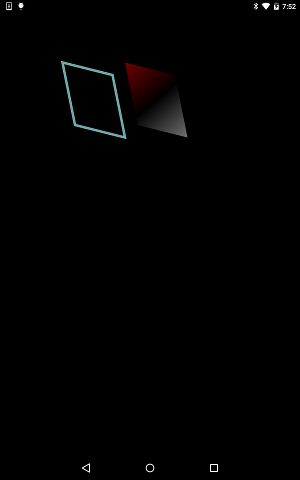

# Draw Path

https://github.com/kyorohiro/hello_skyengine/tree/master/draw_path



```
// following code is checked in 2016/01/13
import 'package:flutter/widgets.dart';
import 'package:flutter/painting.dart';
import 'package:flutter/rendering.dart';
import 'dart:ui' as sky;

void main() {
  runApp(new DrawPathWidget()); //new GameTest());
}

class DrawPathWidget extends OneChildRenderObjectWidget {
  RenderObject createRenderObject() {
    return new DrawPathObject();
  }
}

class DrawPathObject extends RenderBox {
  void paint(PaintingContext context, Offset offset) {
    context.canvas.scale(2.5, 2.5);
    context.canvas.translate(50.0, 50.0);
    paintWithStroke(context, offset);
    context.canvas.translate(50.0, 0.0);
    paintWithLinearGradient(context, offset);
  }

  void paintWithStroke(PaintingContext context, Offset offset) {
    Paint p = new Paint();
    p.strokeWidth = 2.0;
    p.style = sky.PaintingStyle.stroke;
    Path path = new Path();
    path.moveTo(0.0, 0.0);
    path.lineTo(10.0, 50.0);
    path.lineTo(50.0, 60.0);
    path.lineTo(40.0, 10.0);
    path.close();
    p.color = new Color.fromARGB(0xaa, 0xaa, 0xff, 0xff);
    context.canvas.drawPath(path, p);
  }

  void paintWithLinearGradient(PaintingContext context, Offset offset) {
    Paint p = new Paint();
    p.style = sky.PaintingStyle.strokeAndFill;

    List<Color> colors = [
      const Color.fromARGB(0xaa, 0xff, 0x00, 0x00),
      const Color.fromARGB(0xaa, 0x00, 0x00, 0x00),
      const Color.fromARGB(0xaa, 0xff, 0xff, 0xff),
    ];
    List<double> stops = [0.0, 0.5, 1.0];
    LinearGradient gg = new LinearGradient(
        begin: new Point(0.0, 0.0),
        end: new Point(50.0, 60.0),
        colors: colors,
        stops: stops);
    p.shader = gg.createShader();

    Path path = new Path();
    path.moveTo(0.0, 0.0);
    path.lineTo(10.0, 50.0);
    path.lineTo(50.0, 60.0);
    path.lineTo(40.0, 10.0);
    path.close();
    context.canvas.drawPath(path, p);
  }
}

```
