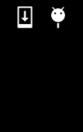

# Draw Rect

https://github.com/kyorohiro/hello_skyengine/tree/master/draw_rect



```
// following code is checked in 2015/01/13
import 'package:flutter/widgets.dart';
import 'package:flutter/painting.dart';
import 'package:flutter/rendering.dart';

void main() {
  runApp(new DrawRectWidget());
}

class DrawRectWidget extends OneChildRenderObjectWidget {
    RenderObject createRenderObject() {
      return new DrawRectObject();
    }
}

class DrawRectObject extends RenderBox {
  void paint(PaintingContext context, Offset offset) {
    Paint p = new Paint();
    p.color = new Color.fromARGB(0xff, 0xff, 0xff, 0xff);
    Rect r = new Rect.fromLTWH(50.0, 100.0, 150.0, 25.0);
    context.canvas.drawRect(r, p);
  }
}
```
