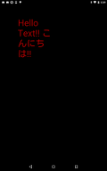

# Draw Text

https://github.com/kyorohiro/hello_skyengine/tree/master/draw_text



```
// following code is checked in 2015/11/05
import 'package:flutter/widgets.dart';
import 'package:flutter/painting.dart';
import 'package:flutter/rendering.dart';
import 'dart:ui' as sky;

void main() {
  runApp(new DrawTextWidget());
}

class DrawTextWidget extends OneChildRenderObjectWidget {
  RenderObject createRenderObject() {
    return new DrawTextObject();
  }
}

class DrawTextObject extends RenderBox {
  void paint(PaintingContext context, Offset offset) {
    Color textColor = const Color.fromARGB(0xaa, 0xff, 0, 0);
    PlainTextSpan textSpan = new PlainTextSpan("Hello Text!! こんにちは!!");
    TextStyle textStyle = new TextStyle(fontSize: 50.0, color: textColor);
    StyledTextSpan testStyledSpan = new StyledTextSpan(textStyle, [textSpan]);
    TextPainter textPainter = new TextPainter(testStyledSpan);

    textPainter.maxWidth = 200.0; //constraints.maxWidth;
    textPainter.minWidth = 200.0; //constraints.minWidth;
    textPainter.minHeight = constraints.minHeight;
    textPainter.maxHeight = constraints.maxHeight;
    textPainter.layout();
    textPainter.paint(context.canvas, new sky.Offset(100.0, 100.0));
  }
}


```
