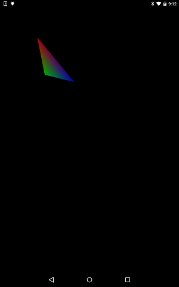

# Draw Vertexs

https://github.com/kyorohiro/hello_skyengine/tree/master/draw_vertices



```
// following code is checked in 2015/11/07
import 'package:flutter/widgets.dart';
import 'package:flutter/rendering.dart';
import 'dart:ui' as sky;

void main() {
  runApp(new DrawVertexsWidget()); //new GameTest());
}

class DrawVertexsWidget extends OneChildRenderObjectWidget {
  RenderObject createRenderObject() {
    return new DrawVertexsObject();
  }
}

class DrawVertexsObject extends RenderBox {
  void paint(PaintingContext context, Offset offset) {
    context.canvas.scale(2.5, 2.5);
    context.canvas.translate(50.0, 50.0);
    paintWithTriangle(context, offset);
  }

  void paintWithTriangle(PaintingContext context, Offset offset) {
    Paint paint = new Paint();
    sky.VertexMode vertexMode = sky.VertexMode.triangles;
    List<Point> vertices = [
      new Point(0.0, 0.0),
      new Point(10.0, 50.0),
      new Point(50.0, 60.0)
    ];
    List<Point> textureCoordinates = [];
    List<Color> colors = [
      const Color.fromARGB(0xaa, 0xff, 0x00, 0x00),
      const Color.fromARGB(0xaa, 0x00, 0xff, 0x00),
      const Color.fromARGB(0xaa, 0x00, 0x00, 0xff)
    ];
    sky.TransferMode transferMode = sky.TransferMode.color;
    List<int> indicies = [0, 1, 2];
    context.canvas.drawVertices(vertexMode, vertices, textureCoordinates,
        colors, transferMode, indicies, paint);
  }

}
```
