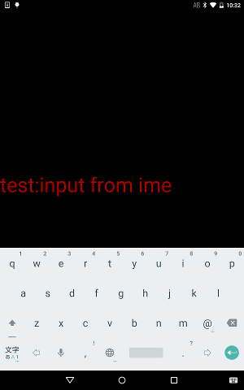

# Input Text From IME (EditableText)

https://github.com/kyorohiro/hello_skyengine/tree/master/edit_text



**[ERROR]**
 * https://github.com/flutter/engine/issues/1662
 * https://github.com/flutter/engine/issues/1663
 * 
```
import 'package:flutter/widgets.dart';
import 'package:flutter/painting.dart';
import 'package:flutter/rendering.dart';
import 'dart:ui' as sky;
import 'package:flutter/services.dart';

main() async {
// setup keyboard
  KeyboardServiceProxy pService = new KeyboardServiceProxy.unbound();
  await shell.requestService(null, pService);
  Keyboard keyboard = new Keyboard(pService.ptr);

// setup editable text
  Color textColor = const Color.fromARGB(0xaa, 0xff, 0, 0);
  sky.Offset offset = new sky.Offset(0.0, 0.0);
  TextStyle textStyle = new TextStyle(fontSize: 50.0, color: textColor);
  EditableString st = new EditableString(text: "test:", onUpdated: () {});
  EditableText text = new EditableText(
      key: new Key("editabletext"),
      value: st,
      style: textStyle,
      scrollOffset: offset,
      focused: true,
      cursorColor: textColor, onContentSizeChanged: (Size newSize) {});
  Center r = new Center(child: text);

// run & show ime
  runApp(r);
  keyboard.show(st.stub, KeyboardType.TEXT);
}
```