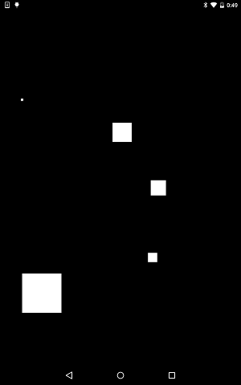

# MultiTouch Event


https://github.com/kyorohiro/hello_skyengine/tree/master/multitouch_event



```
// following code is checked in 2015/10/29
import 'package:flutter/widgets.dart';
import 'package:flutter/rendering.dart';
import 'package:flutter/gestures.dart';

void main() {
  runApp(new DrawRectWidget());
}

class DrawRectWidget extends OneChildRenderObjectWidget {
  RenderObject createRenderObject() {
    return new DrawRectObject();
  }
}

class TouchInfo {
  double x = 0.0;
  double y = 0.0;
  double pressure = 0.0;
  bool isTouch = false;
}

class DrawRectObject extends RenderBox {
  Map<int, TouchInfo> touchInfos = {};
  @override
  void performLayout() {
    size = constraints.biggest;
  }

  @override
  void paint(PaintingContext context, Offset offset) {
    Paint p = new Paint();
    for (TouchInfo t in touchInfos.values) {
      if (t.isTouch) {
        p.color = new Color.fromARGB(0xff, 0xff, 0xff, 0xff);
        double size = 100*t.pressure;
        Rect r = new Rect.fromLTWH(t.x - size/2, t.y - size/2, size, size);
        context.canvas.drawRect(r, p);
      }
    }
  }

  @override
  void handleEvent(InputEvent event, HitTestEntry entry) {
    if (event is PointerInputEvent && entry is BoxHitTestEntry) {
      PointerInputEvent e = event;
      BoxHitTestEntry boxEntry = entry;
      switch (event.type) {
        case "pointerdown":
          touchInfos[e.pointer] = new TouchInfo();
          touchInfos[e.pointer].x = entry.localPosition.x;
          touchInfos[e.pointer].y = entry.localPosition.y;
          touchInfos[e.pointer].pressure = e.pressure/e.pressureMax;
          touchInfos[e.pointer].isTouch = true;
          break;
        case "pointermove":
          touchInfos[e.pointer].x += e.dx;
          touchInfos[e.pointer].y += e.dy;
          touchInfos[e.pointer].pressure = e.pressure/e.pressureMax;
          break;
        case "pointerup":
          // 2015/10/18 return null
          //touchInfos[e.pointer].x += e.dx;
          //touchInfos[e.pointer].y += e.dy;
          touchInfos[e.pointer].isTouch = false;
          break;
        case 'pointercancel':
          print("pointer cancel");
          break;
      }
      markNeedsPaint();
    }
  }
}
```
