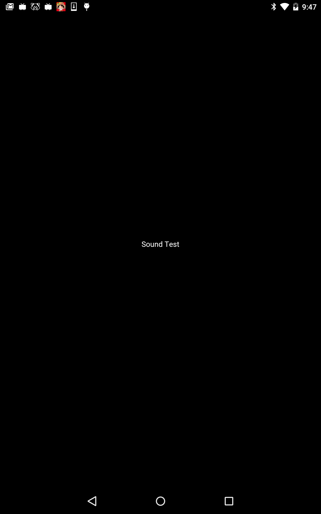

# Sound Test

https://github.com/kyorohiro/hello_skyengine/tree/master/draw_image



```
import 'package:sky/widgets.dart';
import 'dart:async';
import 'package:sky/src/services/fetch.dart';
import 'package:mojo/core.dart';
import 'package:sky_services/media/media.mojom.dart';
import 'package:sky/services.dart';

main() async {
  runApp(new Center(child: new Text("Sound Test")));
  MojoDataPipeConsumer data =
      await ResouceLoader.load("bgm_maoudamashii_acoustic09.mp3");
  SoundTest test = new SoundTest(data);
  test.play();
}

class ResouceLoader {
  static Future<MojoDataPipeConsumer> load(String url) async {
    UrlResponse response = await fetchUrl(url);
    return response.body;
  }
}

class SoundTest {
  MojoDataPipeConsumer data;
  SoundTest(this.data) {}

  MediaServiceProxy service = new MediaServiceProxy.unbound();
  MediaPlayerProxy player = new MediaPlayerProxy.unbound();

  play() async {
    print("start play");
    shell.requestService(null, service);
    service.ptr.createPlayer(player);
    await player.ptr.prepare(data);
    player.ptr.seekTo(0);
    player.ptr.start();
    print("/start play");
  }

  stop() async {
    player.ptr.pause();
  }
}
```