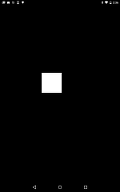

# Touch Event

https://github.com/kyorohiro/hello_skyengine/tree/master/touch_event



```
// following code is checked in 2015/11/05
import 'package:flutter/widgets.dart';
import 'package:flutter/rendering.dart';


void main() {
  runApp(new DrawRectWidget());
}

class DrawRectWidget extends OneChildRenderObjectWidget {
  RenderObject createRenderObject() {
    return new DrawRectObject();
  }
}

class DrawRectObject extends RenderBox {
  double x = 100.0;
  double y = 100.0;

  @override
  void performLayout() {
    size = constraints.biggest;
  }

  @override
  void paint(PaintingContext context, Offset offset) {
    Paint p = new Paint();
    p.color = new Color.fromARGB(0xff, 0xff, 0xff, 0xff);
    Rect r = new Rect.fromLTWH(x - 50.0, y - 50.0, 100.0, 100.0);
    context.canvas.drawRect(r, p);
  }

  @override
  void handleEvent(InputEvent event, HitTestEntry entry) {
    if (event is PointerInputEvent && entry is BoxHitTestEntry) {
      PointerInputEvent e = event;
      if (event.type == "pointerdown") {
        x = entry.localPosition.x;
        y = entry.localPosition.y;
      } else {
        // 2015/10/18 return null
        x += (e.dx==null?0:e.dx);
        y += (e.dy==null?0:e.dy);
      }
      markNeedsPaint();
    }
  }
}

```
