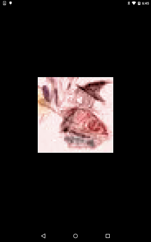

# Widget Column

https://github.com/kyorohiro/hello_skyengine/tree/master/widget_asset_image



```
//
// following code is checked in 2016/01/13
//
import 'package:flutter/widgets.dart';
import 'package:flutter/services.dart';
import 'package:flutter/material.dart';


main() async {
  final double width = 300.0;
  final double height = 300.0;
  final ColorFilter colorFilter =
   new ColorFilter.mode(new Color.fromARGB(0xaa, 0xff, 0xaa, 0xaa), TransferMode.color);
  //final ImageFit fit = ImageFit.fill;
  //final ImageRepeat repeat = ImageRepeat.repeat;
  //final Rect centerSlice = new Rect.fromLTWH(0.0, 0.0, 20.0, 20.0);

  //
  //
  // 2015 12/13 icon.jpeg is error
  AssetImage i = new AssetImage(
//    name:"assets/icon.jpeg",
    name:"assets/a.png",
    bundle:rootBundle,
    colorFilter:colorFilter,
    width:width,height:height
//    repeat:repeat,fit:fit,centerSlice:centerSlice
  );
  runApp(new Center(child:i));
}


```

```
#flutter.yaml
assets:
 - assets/icon.jpeg
 - assets/a.png
```
