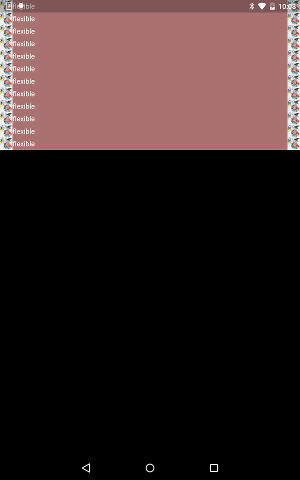

# Widget Flexible

https://github.com/kyorohiro/hello_skyengine/tree/master/widget_flexible



```
import 'package:flutter/widgets.dart';
import 'package:flutter/services.dart';
import 'package:flutter/material.dart';
import 'dart:ui' as sky;
import 'dart:math' as math;
import 'dart:async';

import 'package:flutter/material.dart';

void main() {
  var felexibleTest = new Container(
      decoration: new BoxDecoration(
          backgroundColor: new Color.fromARGB(0xaa, 0xff, 0xaa, 0xaa)),
      child: new Row([
        new NetworkImage(src: 'icon.jpeg', width: 25.0, height: 25.0),
        new Flexible(child: new Text('flexible')),
        new NetworkImage(src: 'icon.jpeg', width: 25.0, height: 25.0),
      ]));
  runApp(new Column([
    felexibleTest,felexibleTest,felexibleTest,
    felexibleTest,felexibleTest,felexibleTest,
    felexibleTest,felexibleTest,felexibleTest,
    felexibleTest,felexibleTest,felexibleTest
  ]));
}

```
