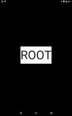
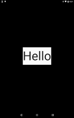
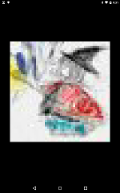

# Widget Navigator

https://github.com/kyorohiro/hello_skyengine/tree/master/widget_navigator



```
// following code is checked in 2015/10/31
import 'package:flutter/widgets.dart';
import 'package:flutter/material.dart';


void main() {
  print("=========");
  String title = "TITLE";
  ThemeData theme = new ThemeData.light();
  Map<String, RouteBuilder> routes = {
    "/": (RouteArguments args) => new MyStatlessComponentRoot(args),
    "/text": (RouteArguments args) => new MyStatlessComponentText(args),
    "/image": (RouteArguments args) => new MyStatlessComponentImage(args)
  };
  MaterialApp app = new MaterialApp(title: title, theme: theme, routes: routes);
  runApp(app);
}

class MyStatlessComponentRoot extends StatelessComponent {
  RouteArguments args;
  MyStatlessComponentRoot(this.args) {}
  Widget build(BuildContext context) {
    Widget content = new Material(child: new Text("ROOT", style: new TextStyle(fontSize: 100.0)));
    GestureDetector gesture = new GestureDetector(child: content, onTap: () {
      // args.context == build'args context
      Navigator.of(args.context).pushNamed("/image");
    }, onLongPress: () {
      Navigator.of(args.context).pushNamed("/text");
    });
    return new Center(child: gesture);
  }
}

class MyStatlessComponentImage extends StatelessComponent {
  RouteArguments args;
  MyStatlessComponentImage(this.args) {}
  Widget build(BuildContext context) {
    Widget content = new Material(child: new NetworkImage(src: 'icon.jpeg', width: 500.0, height: 500.0));
    GestureDetector gesture = new GestureDetector(child: content, onTap: () {
      Navigator.of(args.context).pop();
    });
    return new Center(child: gesture);
  }
}

class MyStatlessComponentText extends StatelessComponent {
  RouteArguments args;
  MyStatlessComponentText(this.args) {}
  bool isPop = false;
  Widget build(BuildContext context) {
    Widget content = new Material(
        child: new Text("Hello", style: new TextStyle(fontSize: 100.0)));
    GestureDetector gesture = new GestureDetector(child: content, onTap: () {
      Navigator.of(context).pop();
    });
    return new Center(child: gesture);
  }
}

```
