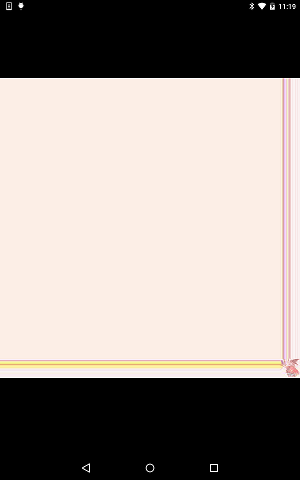

# Widget NetworkImage

https://github.com/kyorohiro/hello_skyengine/tree/master/widget_networkimage



```
import 'package:flutter/widgets.dart';
import 'package:flutter/services.dart';
import 'package:flutter/material.dart';
import 'dart:ui' as sky;

main() async {
  String src = "https://avatars0.githubusercontent.com/u/1310669?v=3&s=40";
  //double width = 10.0;
  //double height = 10.0;
  sky.ColorFilter colorFilter = new sky.ColorFilter.mode(
      new Color.fromARGB(0xaa, 0xff, 0xaa, 0xaa), TransferMode.lighten);
  ImageFit fit = ImageFit.contain;
  //ImageRepeat repeat = ImageRepeat.repeat;
  Rect centerSlice = new Rect.fromLTWH(0.0, 0.0, 1.0, 1.0);
  NetworkImage image = new NetworkImage(
      src: src,
      //width:width,
      //height:height,
      colorFilter: colorFilter,
      fit: fit,
      //repeat:repeat//,
      centerSlice: centerSlice);

  runApp(image);
}

```
