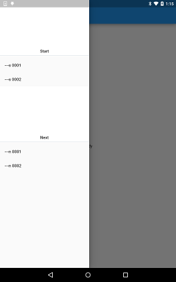

# Widget Scaffold and Drawer

https://github.com/kyorohiro/hello_skyengine/tree/master/widget_scaffold_drawer



```
// following code is checked in 2015/11/13

import 'dart:ui' as ui;

import 'package:flutter/material.dart';
import 'package:flutter/painting.dart';
import 'package:flutter/rendering.dart';

void main() {
  // 2015/10/26 if use IconButton's icon option, need MatrialApp?
  runApp(new MaterialApp(
      title: "Drawer",
      routes: <String, RouteBuilder>{
        '/': (RouteArguments args) {
          return new DrawerTest();
        },
      }));
}

class DrawerTest extends StatefulComponent {
  State createState() {
    return new DrawerTestState();
  }
}

class DrawerTestState extends State<DrawerTest> {
  Widget build(BuildContext context) {
    Widget body = new Center(child: new Text("body"));
    Widget toolBar = new ToolBar(
        left: new IconButton(icon: "navigation/menu", onPressed: showMyDrawer),
        center: new Text("center"));
    Scaffold s = new Scaffold(toolBar: toolBar, body: body);
    return s;
  }

  void showMyDrawer() {
    Block block = new Block(<Widget>[
      createMyHeader("Start"),
      createMyItem("---s 0001"),
      createMyItem("---s 0002"),
      createMyHeader("Next"),
      createMyItem("---n 0001"),
      createMyItem("---n 0002")
    ]);

    showDrawer(context: this.context, child: block, level: 3);
  }

  DrawerHeader createMyHeader(String message) {
    return new DrawerHeader(child: new Text("${message}"));
  }

  DrawerItem createMyItem(String message) {
    return new DrawerItem(onPressed: () {
      print("pressed ${message}");
    }, child: new Text("${message}"));
  }
}
```


```
# flutter.yaml
material-design-icons:
  - name: action/account_balance
  - name: action/assessment
  - name: action/help
  - name: action/search
  - name: action/settings
  - name: action/thumb_down
  - name: action/thumb_up
  - name: content/add
  - name: navigation/arrow_back
  - name: navigation/menu
  - name: navigation/more_vert
```
