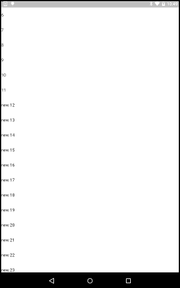

# Widget Scrollable List

https://github.com/kyorohiro/hello_skyengine/tree/master/widget_scrollablelist



```
//
// following code is checked in 2016/01/13
// interface is change , following code is wrong.
//
import 'package:flutter/material.dart';

class ScrollableComponent extends StatefulComponent {
  ScrollableListState createState() => new ScrollableListState();
}

class ScrollableListState extends State<ScrollableComponent> {
  List<String> itemContents = ["0", "1", "2", "3", "4", "5", "6", "7", "8", "9", "10", "11"];

  Widget build(BuildContext context) {

    ScrollableList list = new ScrollableList<String>(
        items: itemContents, itemExtent: 50.0,
        scrollableListPainter: new ScrollbarPainter(),
        itemBuilder: (BuildContext context, String content, int index){
      return new Text(content, key: new ValueKey<String>(content));
    });

    GestureDetector tap = new GestureDetector(onTap: () {
      itemContents.add("new ${itemContents.length}");
      setState(() {});
    }, child: list);

    Widget scrollable = new Container(child: tap);
    return new Container(child: new Center(child: new Card(child: scrollable)));
  }
}

void main() {
  runApp(new ScrollableComponent());
}

```
