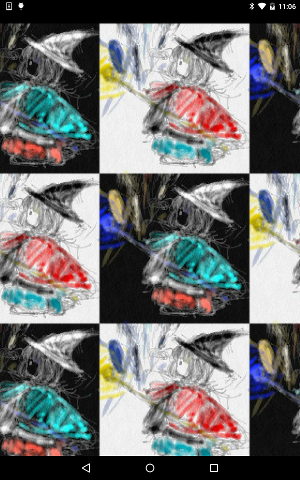

# Widget ScrollableViewport

https://github.com/kyorohiro/hello_skyengine/tree/master/widget_scrollableviewport



```
// following code is checked in 2015/12/13
import 'package:flutter/material.dart';
import 'package:flutter/services.dart';
void main() {
  // ScrollDirection.vertical.both is developping now. 2015/10/20
  //https://github.com/flutter/engine/issues/888
  Widget b1 = new AssetImage(name: "assets/a.png", width: 300.0, height: 300.0, bundle:rootBundle);
  Widget b2 = new AssetImage(name: "assets/b.png", width: 300.0, height: 300.0, bundle:rootBundle);
  Row r1 = new Row([b1, b2, b1, b2, b1, b2, b1, b2, b1]);
  Row r2 = new Row([b2, b1, b2, b1, b2, b1, b2, b1, b2]);
  Column g = new Column([r1, r2, r1, r2, r1, r2, r1, r2, r1]);
  ScrollableViewport viewPortH = new ScrollableViewport(
      child: g, scrollDirection: ScrollDirection.horizontal,
      onScroll: (double scrollOffset) {
    print("---h-${scrollOffset}--");
  });
  ScrollableViewport viewPortV = new ScrollableViewport(
      child: viewPortH, scrollDirection: ScrollDirection.vertical,
      onScroll: (double scrollOffset) {
    print("---v-${scrollOffset}--");
  });
  runApp(viewPortV);
}


```
```
#flutter.yaml
assets:
 - assets/icon.jpeg
 - assets/icon2.jpeg
 - assets/a.png
 - assets/b.png
```
