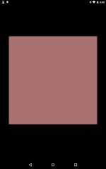
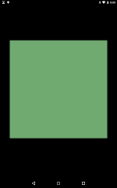
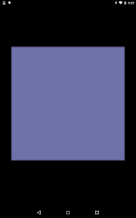

# Widget StatefulComponent

https://github.com/kyorohiro/hello_skyengine/tree/master/widget_stateful



```
import 'package:flutter/material.dart';

void main() {
  runApp(new MyStatefulComponent());
}

class MyStatefulComponent extends StatefulComponent {
  State createState() {
    return new MyState();
  }
}

class MyState extends State<MyStatefulComponent> {
  int colorId = 0;
  Color backgroundColor = new Color.fromARGB(0xaa, 0xff, 0xaa, 0xaa);
  Widget build(BuildContext context) {
    BoxDecoration decoration = new BoxDecoration(backgroundColor: backgroundColor);
    Container c = new Container(width: 500.0, height: 500.0, decoration: decoration);
    GestureDetector d = new GestureDetector(onTap: () {
      setState(updateColor);
    }, child: c);
    return new Center(child: d);
  }

  updateColor() {
    colorId++;
    switch (colorId % 3) {
      case 0:
        backgroundColor = new Color.fromARGB(0xaa, 0xff, 0xaa, 0xaa);
        break;
      case 1:
        backgroundColor = new Color.fromARGB(0xaa, 0xaa, 0xff, 0xaa);
        break;
      case 2:
        backgroundColor = new Color.fromARGB(0xaa, 0xaa, 0xaa, 0xff);
        break;
    }
  }
}

```
